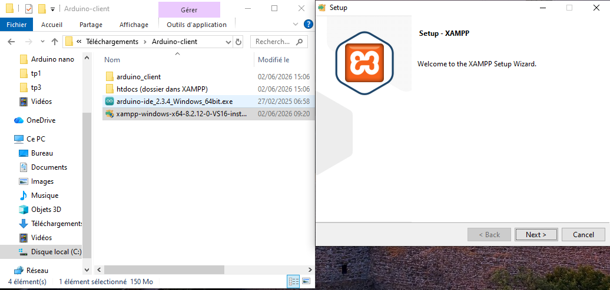
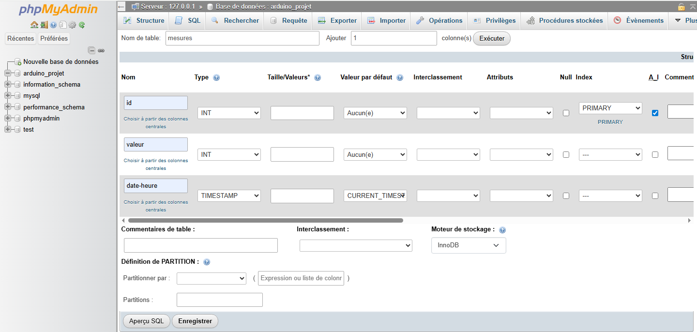
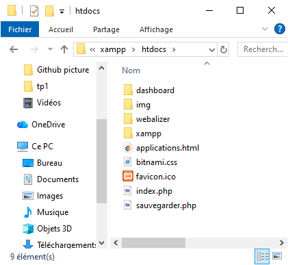
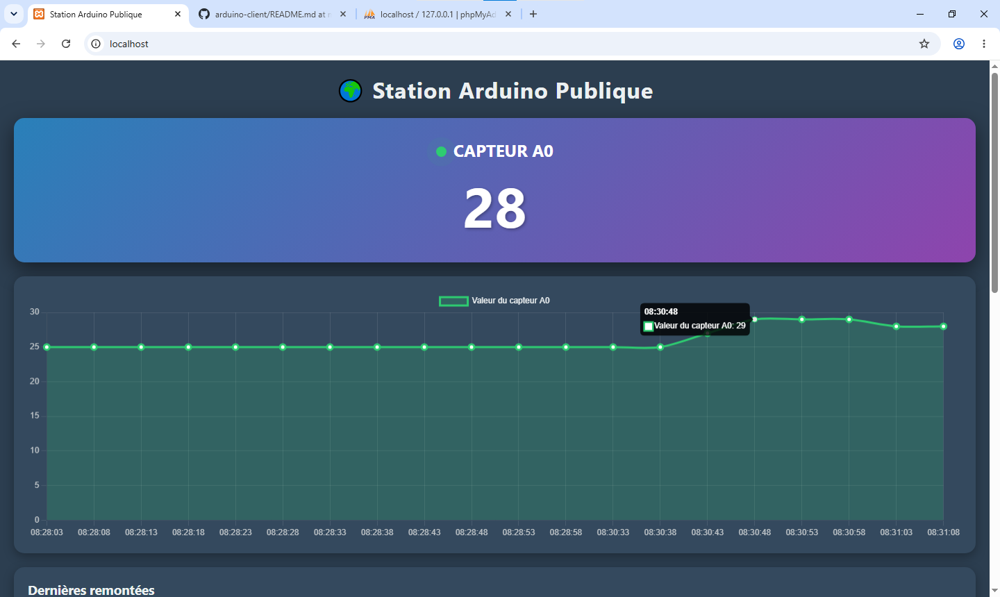

# 🌍 Utilisation d'un Arduino pour envoyer des données dans une DB (Data Base) en tant que client (IoT)

Ce projet est un système IoT (Internet of Things) complet de bout en bout. Il permet à un Arduino Nano de lire la température d'une pièce via un capteur DS18B20, de l'envoyer sur le réseau local via un shield Ethernet, et d'afficher les données en temps réel sur un tableau de bord web (avec graphique et historique) en passant par une Data Base.

## 🛠️ Matériel Requis

* **Microcontrôleur :** Arduino Nano
* **Réseau :** Module Ethernet (ex: ENC28J60)
* **Capteur :** DS18B20 (Capteur de température numérique)
* **Composant :** Résistance de 4.7 kΩ 
* **Câblage :** Câble RJ45, Câble USB (branché à l'arrière du PC pour une alimentation stable)

## 💻 Logiciels & Prérequis

* **Serveur local :** [XAMPP](https://www.apachefriends.org/fr/index.html) (Apache & MySQL)
* **Le ficher RAR :** Extraire le contenue du RAR sur le bureau
* **IDE :** Arduino IDE (v2.x recommandée)
* **Bibliothèques Arduino :**
  * `UIPEthernet` (ou `Ethernet` selon le shield)
  * `OneWire` (par Jim Studt, Paul Stoffregen...)
  * `DallasTemperature` (par Miles Burton)

---

## ⚙️ 1. Configuration de la Base de Données (MySQL)

1. Installer et executer **XAMPP** et démarrer les modules **Apache** et **MySQL**



2. Ouvrir le navigateur et aller sur `http://localhost/phpmyadmin/`.
3. Créer une base de données nommée `arduino_projet`.
4. Créer une table nommée `mesures` avec les colonnes suivantes :
   * `id` : INT, Auto-Incrément (A_I), Clé Primaire.
   * `valeur` : INT.
   * `date_heure` : TIMESTAMP (Valeur par défaut : CURRENT_TIMESTAMP).

  

---

## 🌐 2. Configuration du Serveur Web (PHP)

Dans le dossier `C:\xampp\htdocs\`, placer les deux fichiers suivants :



### A. `sauvegarder.php` (L'API de réception)
Ce script est appelé par l'Arduino pour insérer les données dans la base.
*(Penser à y configurer les identifiants de la base de données : `$utilisateur = "root"`, `$mot_de_passe = "ton_mot_de_passe"`).*

### B. `index.php` (Le Tableau de Bord)
Interface publique affichant :
* La température en direct.
* Un graphique dynamique généré avec **Chart.js**.
* Un tableau d'historique des 20 dernières mesures.
* *Fonctionnalité : Auto-refresh toutes les 5 secondes.*

---

## 🔌 3. Câblage de l'Arduino

| Capteur DS18B20 | Arduino Nano | Remarque |
| :--- | :--- | :--- |
| **GND** (-) | GND | |
| **VCC** (+) | 5V | |
| **DATA** (Signal) | D5 | Placer une résistance 4.7kΩ entre VCC et DATA |

---

## 🚀 4. Configuration et Déploiement

1. Une fois l'IDE installé, dans le code source Arduino (`arduino_client.ino`), modifier l'adresse IP du serveur XAMPP pour qu'elle corresponde à celle de la machine hôte :
   ```cpp
   IPAddress server(192, 168, X, X); // Remplacer par l'IP locale du PC


## 🔒 5. Sécurisation du Système (Mots de passe)

Pour éviter que n'importe qui puisse modifier la base de données ou accéder au tableau de bord, deux niveaux de sécurité ont été mis en place.

### A. Sécuriser l'accès à phpMyAdmin (Base de données)
Par défaut sous XAMPP, l'utilisateur `root` n'a pas de mot de passe. Pour en définir un :
1. Aller dans **phpMyAdmin** > Onglet **Comptes utilisateurs**.
2. Sur la ligne de l'utilisateur `root` (localhost), cliquer sur **Modifier les privilèges** puis sur **Modifier le mot de passe**. (en changeant votre mot de passe, vous allez perdre accès a votre phpMyAdmin, avec un code d'erreur, mais pour régler sa, aller dans votre répértoire XAMPP et dans phpMyAdmin, une fois dedans, ouvrer le ficher **config.inc.php** et taper votre mot de passe sur la ligne 21, sauvegarder et vous serez de retour sur la page phpMyAdmin)
3. Saisir le nouveau mot de passe et valider.
4. **Important :** Mettre à jour ce nouveau mot de passe dans les fichiers PHP (`sauvegarder.php` et `index.php`) à la ligne de connexion :
   ```php
   $mot_de_passe = "nouveau_mot_de_passe";
A la fin, vous vous retrouverez avec sa :


